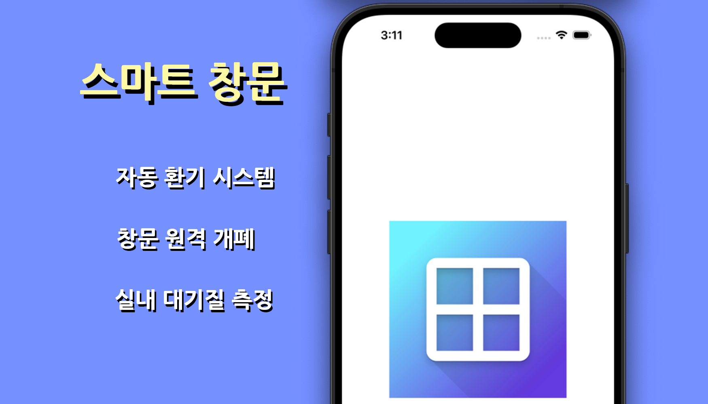
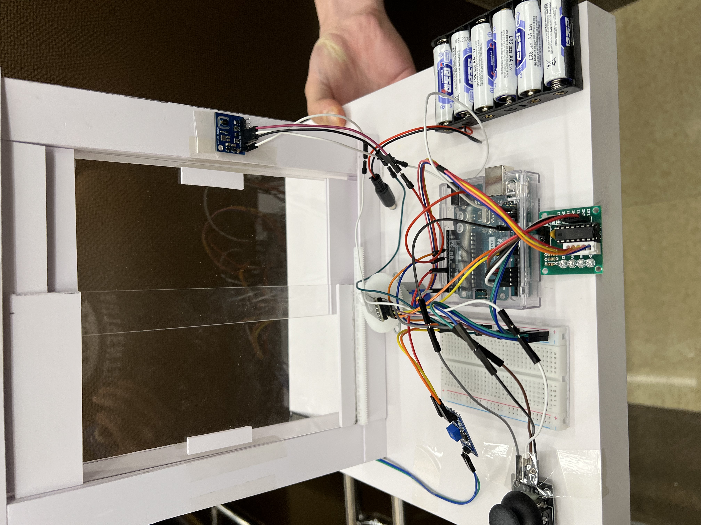

<!-- 프로젝트 제목 -->
# 스마트 창문

    
    
환경에 맞게 스스로 동작하고 스마트폰으로도 제어 가능한 스마트 창문 개발 프로젝트

 

<!-- 프로젝트 개요 -->
## 프로젝트 개요  

    

"스마트 창문"은 아두이노를 기반으로 제작된 IoT 스마트 창문으로, 환경에 따라 스스로 열고 닫으며 스마트폰과 블루투스 연결을 통해 앱으로도 제어할 수 있습니다. 창문을 편리하게 여닫고, 대기질에 따른 자동 환기 시스템을 통한 건강 증진을 위해 주제를 선정하였습니다.

### 프로젝트 기간  
* 2024.04 ~ 2024.06  

### 개발 환경  
* Android Studio  
* Flutter  
* Arduino IDE  
* C++  

 

<!-- 프로젝트 상세 -->
## 상세 기능  
### 1. 블루투스 기기 검색 및 연결 화면  
| 연결 화면 |
|---------|
||  
* 검색된 여러 블루투스 장치 중, 스마트 창문에 해당하는 기기만 검색되도록 장치 이름을 기준으로 필터링 적용  

### 2. 연결 후 제어 화면  
| 최초 화면 | 작동 후 화면 |
|---------|-----------|
|||
* 최초 연결 이후에는 현재 창문 상태와 동기화 진행  
* 현재 상태에 따라 **OPEN** 또는 **CLOSE** 가능
* '자동 모드'가 활성화되면 창문은 설정된 조건에 따라 측정되는 센서 값을 기준으로 작동  
  * 우적 센서에 일정 수치 이상의 빗물이 감지되는 경우 **닫힘**  
  * 요리나 화재 발생 등과 같은 이유로 실내 CO2 농도가 비이상적인 수치를 보이는 경우 **열림**  
  * 실외 미세먼지 농도가 일정 수치 이상인 경우 **닫힘**  